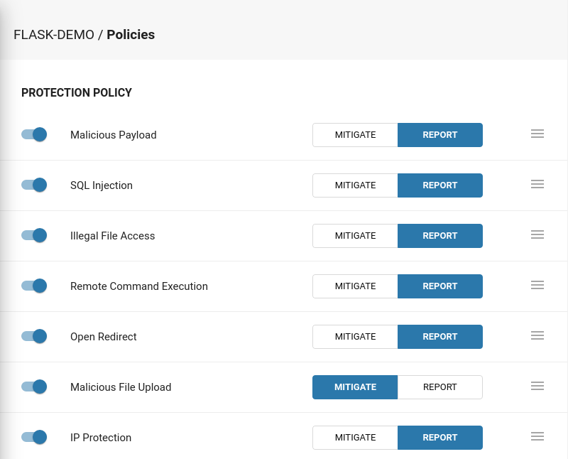
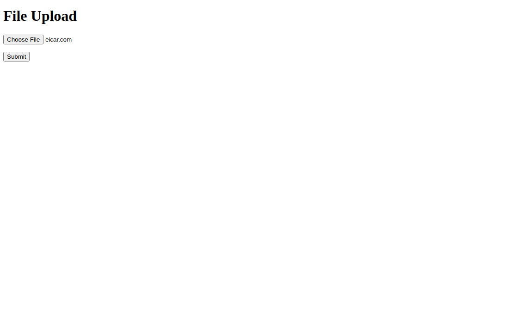
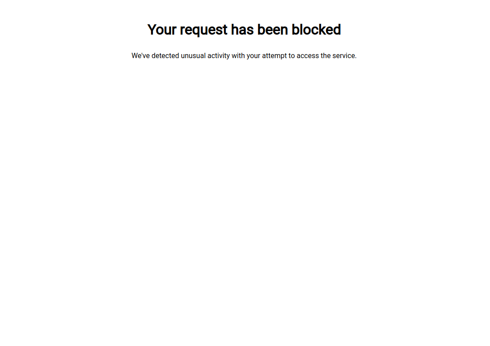
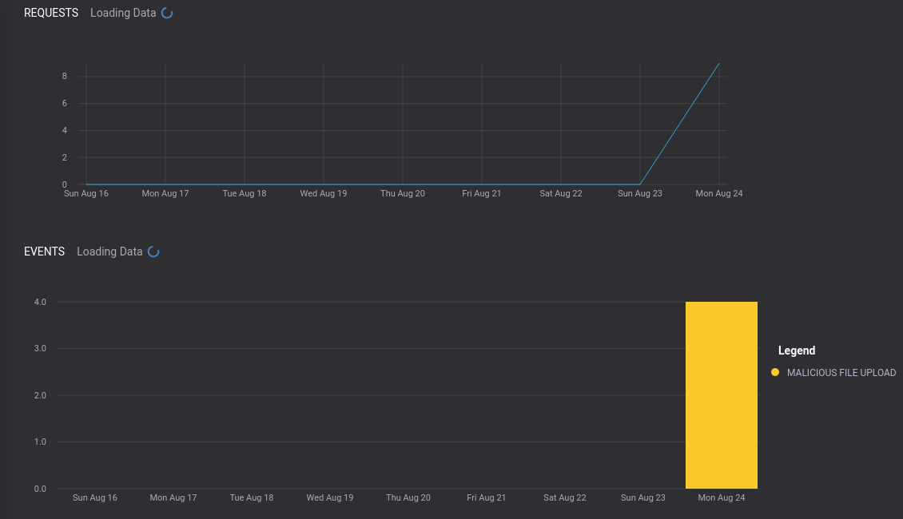
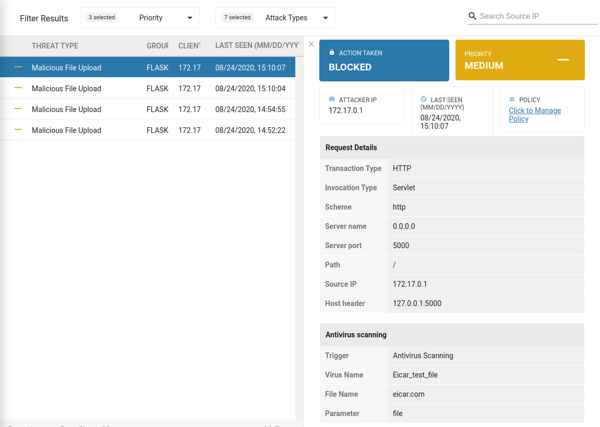

# Application Security - Flask demo

A simple Flask app with [Application Security](https://docs.app-security.trendmicro.com/) embedded. 

## Start app

Start the app using the following command:

```
docker run \
--name flask-app-sec \
-d -p 5000:5000 \
-e TREND_AP_KEY=<AP_KEY> \
-e TREND_AP_SECRET=<AP_SECRET> \
oznetnerd/flask-app-sec
```

### Debugging

You can add debug outputs by using the `ENABLE_DEBUGGING` environment variable, like so:

```
docker run \
--name flask-app-sec \
-d -p 5000:5000 \
-e TREND_AP_KEY=<AP_KEY> \
-e TREND_AP_SECRET=<AP_SECRET> \
-e ENABLE_DEBUGGING=True \
oznetnerd/flask-app-sec
```
 
Below is an example of the debug output:

```
Method: POST
Headers:
('Host', '127.0.0.1:5000')
('Connection', 'keep-alive')
('Content-Length', '265')
('Cache-Control', 'max-age=0')
('Origin', 'http://127.0.0.1:5000')
('Upgrade-Insecure-Requests', '1')
('Dnt', '1')
('Content-Type', 'multipart/form-data; boundary=----WebKitFormBoundary8hzXxhZrJjMv0M07')
('User-Agent', 'Mozilla/5.0 (X11; Linux x86_64) AppleWebKit/537.36 (KHTML, like Gecko) Chrome/86.0.4240.111 Safari/537.36')
('Accept', 'text/html,application/xhtml+xml,application/xml;q=0.9,image/avif,image/webp,image/apng,*/*;q=0.8,application/signed-exchange;v=b3;q=0.9')
('Sec-Fetch-Site', 'same-origin')
('Sec-Fetch-Mode', 'navigate')
('Sec-Fetch-User', '?1')
('Sec-Fetch-Dest', 'document')
('Referer', 'http://127.0.0.1:5000/')
('Accept-Encoding', 'gzip, deflate, br')
('Accept-Language', 'en-AU,en-GB;q=0.9,en-US;q=0.8,en;q=0.7')
('Cookie', 'MCPopupClosed=yes')
```

If malicious files are not detected, use the above output to ensure that:
  * `Method` is `POST`
  *  `Content-Type` is `multipart/form-data` and that `boundary=` [is valid](https://ec.haxx.se/http/http-multipart).

## Settings

1. Enable the **"Malicious File Upload"** policy.



2. Upload a file with malware (e.g EICAR test file).



3. You will be redirected to the default block page:



4. Check events:



5. And details of the malware:



# Contact

* Blog: oznetnerd.com
* Email: will@oznetnerd.com